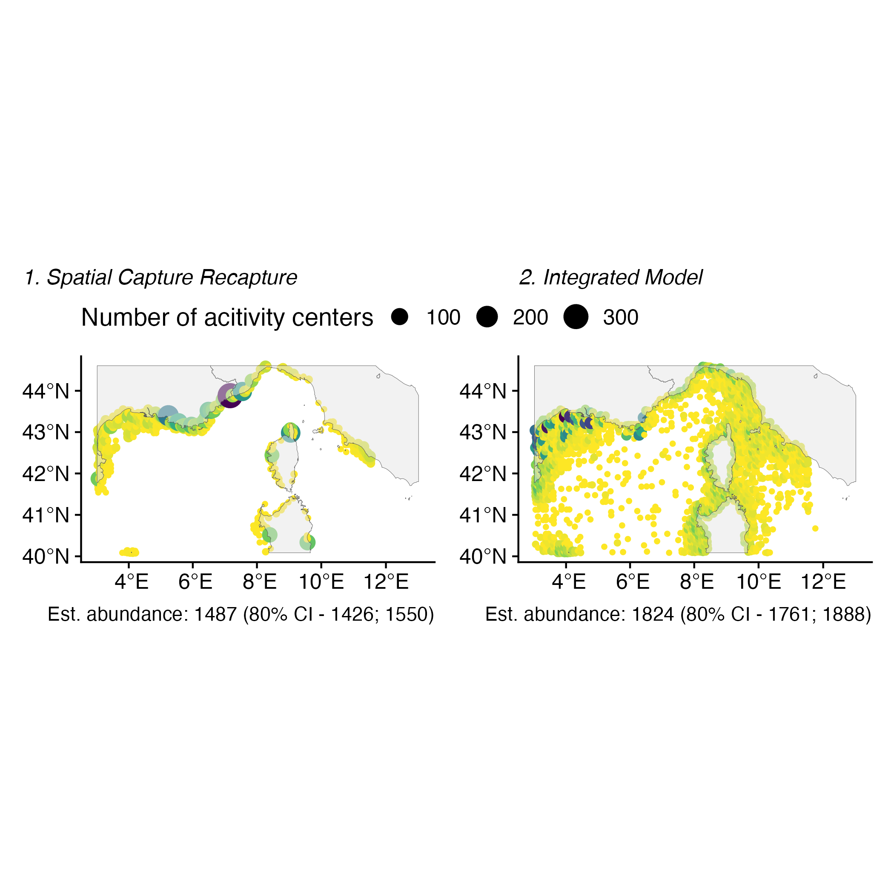

In this document, I present the results of the comparison between:  

  * **Distance Sampling** (DS)
  * **Spatial Capture Recapture**(SCR)
  * an **Integrated spatial model** that combine DS and SCR data.
  
We ran each model with bottlenose dolphins (*Tursiops truncatus*) data collected in the French Mediterranean Sea.
  
# Maps of bottlenose dolphin density {}

![**1. Density of bottlenose dolphins** (*Tursiops truncatus*) estimated from 1. Distance Sampling (*DS*), 2. Spatial Capture Recapture (*SCR*), 3. Integrated model. Lighter color indicates more individuals per area unit. All models predicted higher density in coastal seas, while integrated models predicted more homogeneous density across the study area. Note that density scales are different between maps, indicating a higher overall population size for DS model than for Integrated model and SCR model.  **B. Differences between model estimates.** 1. Density estimated by DS substracted to density estimated by the Integrated model, 2. Density estimated by SCR substrated to density estimated by the Integrated model. **Negative** differences indicate that **DS (or SCR) model predicted more dolphins** than the integrated model. **Positive** differences indicate that **DS (or SCR) model predicted less dolphins** than the integrated model.](fig3.png)

Overall, DS predicted more dolphins in the entire study area. However, density differences between DS and integrated model are greater on the coastal seas where DS predicted particularly more dolphins. Besides, density differences values between SCR and integrated model are closer to 0 than those between DS and integrated, which reflected that SCR estimates are closer to those of the integrated model than DS estimates. However, Integrated predicted more dolphins in the pelagic seas than SCR, but less dolphins in the coastal seas. Then, density differences highlight the smoother prediction of the Integrated model between pelagic and coastal seas.

# Spatial integrated model

![Graphical description of the Spatial Integrated Model (SIM) that combines Spatial Capture Recapture (SCR), and Distance Sampling (DS). The SIM is a hierarchical model with three processes: i) latent population size E(N) and density $\lambda$ informed by an inhomogeneous point process, ii) DS observation process that link the line-transect dataset to the latent density surface, iii) SCR observation process that links the detection histories to the latent density. The observation process is stochastic according to detection probability. For DS model, the observed group size nobs is a Binomial draw in the latent abundance N at the sampling location. For SCR model, observing an individual i is a Bernoulli draw with a detection probability pi. The location of $id_i$, the activity center of individual *i* is a Multinomial draw in thepredicted density $\lambda$](Fig1_v2_1.png)